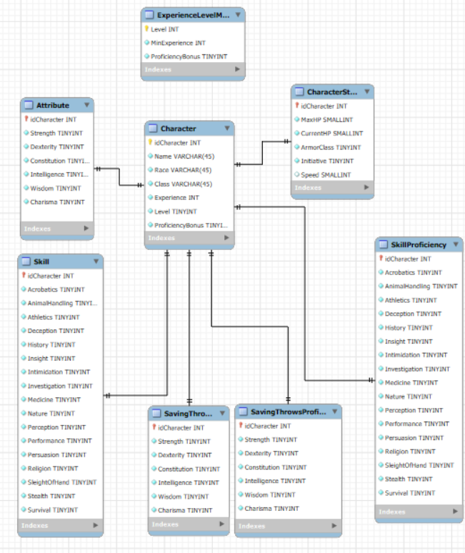

# База данных для генератора листов персонажей для игры Dungeons & Dragons



## Описание

Этот проект представляет собой **реляционную базу данных**, разработанную в рамках курсовой работы.
Целью проекта является автоматизация хранения и обработки информации о персонажах в настольной ролевой игре **Dungeons & Dragons (5-ой редакции)**.

Система позволяет создавать, хранить и автоматически обновлять ключевые игровые параметры персонажей: характеристики, навыки, спасброски, инициативу, уровень и бонус мастерства - с учётом всех зависимостей по правилам D&D.

---

## Назначение

Разработанная база данных предназначена для:
- **автоматизации заполнения листа персонажа**;
- **облегчения расчётов** (модификаторы, бонусы, навыки и т.д.);
- **минимизации ошибок при ручном вводе**;

---

## Типовые запросы

**1. Фильтрация персонажей по классу (например, Плут):**

```sql
SELECT
  Name AS `Имя персонажа`,
  Race AS `Раса`,
  Class AS `Класс`,
  Level AS `Уровень`
FROM `Character`
WHERE Class = 'Плут';
```

**2. Поиск персонажей, владеющих определенным навыком (например, Акробатика):**

```sql
SELECT
  `Character`.Name AS `Имя персонажа`,
  SkillProficiency.Acrobatics AS `Уровень владения`
FROM `Character`
JOIN SkillProficiency ON `Character`.idCharacter = SkillProficiency.idCharacter
WHERE SkillProficiency.Acrobatics > 0;
```

**3. Вывод персонажа с наибольшим текущим запасом здоровья:**

```sql
SELECT
  `Character`.Name AS `Имя персонажа`,
  CharacterStats.CurrentHP AS `Текущее ХП`
FROM `Character`
JOIN CharacterStats ON `Character`.idCharacter = CharacterStats.idCharacter
ORDER BY CharacterStats.CurrentHP DESC
LIMIT 1;
```

**4. Показ значений и модификаторов атрибутов конкретного персонажа:**

```sql
SELECT
  `Character`.Name AS `Имя персонажа`,
  Attribute.Strength AS `Сила`,
  GetModifier(Attribute.Strength) AS `Модификатор Силы`,
  Attribute.Dexterity AS `Ловкость`,
  GetModifier(Attribute.Dexterity) AS `Модификатор Ловкости`,
  Attribute.Constitution AS `Телосложение`,
  GetModifier(Attribute.Constitution) AS `Модификатор Телосложения`,
  Attribute.Intelligence AS `Интеллект`,
  GetModifier(Attribute.Intelligence) AS `Модификатор Интеллекта`,
  Attribute.Wisdom AS `Мудрость`,
  GetModifier(Attribute.Wisdom) AS `Модификатор Мудрости`,
  Attribute.Charisma AS `Харизма`,
  GetModifier(Attribute.Charisma) AS `Модификатор Харизмы`
FROM `Character`
JOIN Attribute ON `Character`.idCharacter = Attribute.idCharacter
WHERE `Character`.Name = 'Имя персонажа';
```

**5. Количество персонажей в каждом игровом классе:**

```sql
SELECT
  `Character`.Class AS `Класс`,
  COUNT(*) AS `Количество_персонажей`
FROM `Character`
GROUP BY `Character`.Class
ORDER BY COUNT(*) DESC;
```

---

## Требования к запуску

- MySQL 8.0+
- Инициализация базы данных с помощью SQL-дампа `dumpDND.sql`
- Использование процедуры `CreateCharacter` для добавления персонажей

---

## Использование нейросети ChatGPT
При создании данной базы данных использовалась нейросеть ChatGPT. С её помощью осуществлялся анализ ошибок, автоматическая генерация тестовых данных и генерации идей для SQL-запросов.

---
